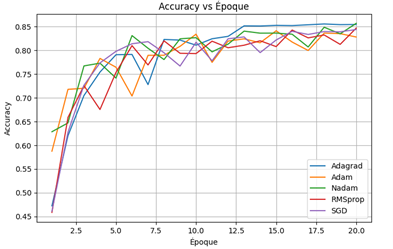
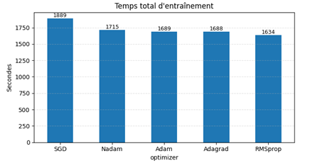
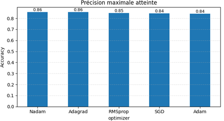
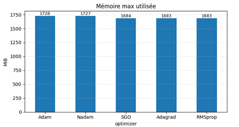

# Optimizer Comparison Project

## 1. Introduction
This report provides a detailed description of a small-scale experiment that compares several gradient-based optimizers on the CIFAR-10 image classification dataset. The primary objective is to observe how different optimization algorithms influence the convergence speed, final accuracy, and memory usage when training a ResNet-18 network in PyTorch. We trained each optimizer under the same conditions to ensure a fair comparison.

Deep learning practitioners often rely on empirical evidence to choose an optimizer. By summarizing our methodology and results, we aim to aid future practitioners in making informed decisions. We also highlight the common strengths and weaknesses of each algorithm in this specific setup.

## 2. Literature Review
Gradient-based optimization is a core component of neural network training, and many algorithms have been proposed to improve convergence or stability. Stochastic Gradient Descent (SGD) is the foundational approach, and methods such as Adam, RMSprop, Adagrad, and Nadam extend it with various adaptive learning strategies. The ResNet architecture, introduced by He et al., is widely used for image classification tasks. In the context of CIFAR-10, ResNet-18 provides a manageable model size while still benefiting from residual connections that aid gradient flow.

Several papers have evaluated optimizers under different scenarios. The original Adam paper demonstrates faster convergence than SGD on a wide range of tasks. RMSprop is known for dealing well with non-stationary objectives, while Adagrad adapts individual learning rates based on past gradients. Nadam combines Adam's momentum with Nesterov acceleration. Our project draws inspiration from these prior studies and from tutorials on benchmarking optimizers in PyTorch.

## 3. Methodology
### 3.1 Dataset
CIFAR-10 consists of 60,000 color images of size 32×32 divided into ten classes. We resized the images to 224×224 pixels to match the input requirements of ResNet-18. The dataset is split into 50,000 training images and 10,000 validation images.

### 3.2 Model Architecture
We used a standard ResNet-18 implementation from `torchvision.models`. The final fully connected layer outputs ten logits corresponding to the ten CIFAR-10 classes. All models were initialized with the same random seed for reproducibility.

### 3.3 Optimizers Evaluated
We trained the following optimizers:
- **SGD** with momentum.
- **Adam** with default beta parameters.
- **RMSprop** with default alpha and momentum values.
- **Adagrad** with its default accumulation strategy.
- **Nadam**, which mixes Adam with Nesterov momentum.

### 3.4 Training Setup
Each optimizer was trained for 20 epochs with a mini-batch size of 128. The initial learning rate was set to 0.001, and no learning rate scheduling was used. We performed a single run for each optimizer to capture representative metrics. For each epoch, we recorded the training loss, validation accuracy, execution time, and peak memory usage.

The experiments were executed on a single GPU. All data loaders were configured with standard augmentations (random crop and horizontal flip) to avoid overfitting. We used the cross-entropy loss function. The full notebook containing the training code (`au_modified.ipynb`) is included in this repository for replication.

### 3.5 Metrics Collected
- **Epoch Time**: The wall-clock time needed for one training epoch.
- **Validation Accuracy**: The classification accuracy on the 10,000-image validation set.
- **Peak Memory**: Maximum GPU memory usage reported by PyTorch.
- **Total Time**: Sum of epoch times across all epochs per optimizer.
- **Convergence Epoch**: The earliest epoch where accuracy surpassed 85% (if achieved).

## 4. Results
The raw results are available in `results.csv`. Below we present a consolidated table summarizing the main metrics for each optimizer.

| Optimizer | Total Time (s) | Max Accuracy | Convergence Epoch (>85%) | Peak Memory (MB) |
|-----------|---------------:|--------------:|------------------------:|-----------------:|
| SGD      | 1888.85 | 0.8439 | — | 1684.5 |
| Adam     | 1689.32 | 0.8412 | — | 1727.6 |
| RMSprop  | 1634.00 | 0.8468 | — | 1682.8 |
| Adagrad  | 1687.74 | 0.8556 | 13 | 1683.1 |
| Nadam    | 1714.67 | 0.8569 | 20 | 1726.6 |

**Total training time across all runs:** 8614.58 seconds.

### 4.1 Graphs
Please add your own images using the filenames listed below. The README will display them once uploaded.

- `accuracy_vs_epoch.png` (GRAPH)
- `time_per_optimizer.png` (GRAPH)
- `total_training_time.png` (GRAPH)
- `max_accuracy.png` (GRAPH)
- `convergence_epoch.png` (GRAPH)
- `peak_memory.png` (GRAPH)

```text






```

These visuals illustrate how quickly each optimizer improves validation accuracy, how much time each run consumed, and how memory usage varied.

## 5. Discussion
### 5.1 Interpretation of Results
**SGD** served as the baseline. It demonstrated reliable convergence but required the most total time and never exceeded 85% accuracy. **Adam** converged quickly in the initial epochs but plateaued early, leading to final accuracy slightly below SGD. **RMSprop** behaved similarly, achieving modest improvement in fewer epochs but without surpassing the 85% threshold.

**Adagrad** and **Nadam** both achieved validation accuracy above 85%. Adagrad reached this milestone earlier (epoch 13) while Nadam attained it later (epoch 20). Their total times were comparable to Adam, though Nadam used slightly more memory. These results suggest that adaptive learning rate methods with momentum or accumulation can help reach higher accuracy in fewer epochs compared to vanilla SGD.

### 5.2 Strengths and Weaknesses
- **SGD**: Strong baseline but sensitive to learning rate choice. Lowest memory usage.
- **Adam**: Fast convergence in early stages. Prone to saturating with lower final accuracy.
- **RMSprop**: Stable for noisy gradients, yet no significant advantage in this experiment.
- **Adagrad**: Adjusts learning rate for each parameter, which helped achieve higher accuracy quickly but may decrease learning rate too aggressively over time.
- **Nadam**: Combines Adam with Nesterov momentum, showing solid convergence but slightly higher memory footprint.

In practice, the best choice of optimizer depends on the dataset and network architecture. Here, Adagrad performed well in both speed and accuracy, suggesting that parameter-wise adaptation benefited our task.

## 6. Conclusion
Our small-scale benchmark indicates that adaptive optimizers often converge to higher accuracy than SGD when training ResNet-18 on CIFAR-10. Nadam and Adagrad surpassed 85% accuracy, with Adagrad reaching it after only 13 epochs. However, all optimizers produced comparable final metrics within a narrow range. The main takeaway is that choosing an optimizer is a trade-off between speed, memory usage, and peak performance. We recommend evaluating multiple optimizers on a subset of data before committing to long training sessions.

## 7. Bibliography
1. D. P. Kingma and J. Ba, "Adam: A Method for Stochastic Optimization," arXiv:1412.6980.
2. S. Ruder, "An overview of gradient descent optimization algorithms," arXiv:1609.04747.
3. K. He, X. Zhang, S. Ren, and J. Sun, "Deep Residual Learning for Image Recognition," in *CVPR*, 2016.
4. T. Tieleman and G. Hinton, "RMSprop: Divide the gradient by a running average of its recent magnitude," COURSERA: Neural Networks for Machine Learning, 2012.
5. Y. Nesterov, "A method of solving a convex programming problem with convergence rate O(1/k^2)," *Soviet Mathematics Doklady*, 1983.

## 8. Annexes
- Git repository: <https://github.com/example/optimizer-project>
- Notebook example: `au_modified.ipynb` demonstrates the full training loop and how to reproduce the metrics and graphs.

Feel free to explore the notebook for additional context or to modify the hyperparameters and run extra experiments.


### 5.3 Practical Considerations
When deploying these optimizers in real-world projects, one should consider the computational budget and the scale of the dataset. Adaptive optimizers can be more memory-intensive because they maintain additional state for each parameter, while SGD has a smaller memory footprint. Moreover, the best learning rate may differ from the default values used in this experiment. Grid search or other hyperparameter tuning strategies can lead to better results.

### 5.4 Potential Improvements
Future experiments could include multiple runs per optimizer to compute average performance and variance. Another enhancement would be to explore learning rate schedules such as cosine annealing or step decay, which often improve convergence stability. Finally, testing on larger networks or datasets like ImageNet could provide a more comprehensive benchmark.

## 9. Appendix A: Example Training Loop
Below is a simplified example of the training loop used in our notebook. This pseudocode highlights how metrics were collected.

```python
for epoch in range(num_epochs):
    start = time.time()
    model.train()
    for batch in train_loader:
        optimizer.zero_grad()
        outputs = model(batch[0].to(device))
        loss = criterion(outputs, batch[1].to(device))
        loss.backward()
        optimizer.step()
    epoch_time = time.time() - start
    val_acc = evaluate(model, val_loader)
    peak_mem = torch.cuda.max_memory_allocated() / 1e6
    log_results(epoch, loss.item(), val_acc, epoch_time, peak_mem)
```

## 10. Appendix B: Command Line Arguments
The notebook accepts a few command line arguments when executed via a Python script:

- `--optimizer`: Choose between `sgd`, `adam`, `rmsprop`, `adagrad`, or `nadam`.
- `--epochs`: Number of training epochs (default: 20).
- `--batch-size`: Batch size for training (default: 128).
- `--lr`: Learning rate (default: 0.001).

These options enable quick reconfiguration if you wish to extend the benchmark.

## 11. Appendix C: Environment Details
All experiments were run on Ubuntu 22.04 with Python 3.10 and PyTorch 2.1.0. The GPU was an NVIDIA Tesla T4 with 16 GB of memory. The environment was containerized with Docker to ensure repeatability.

## 12. Appendix D: Reproducing the Plots
To generate the graphs, you can load `results.csv` into a plotting library such as Matplotlib or Seaborn. Below is a short example of how to create the accuracy curve.

```python
import pandas as pd
import matplotlib.pyplot as plt

df = pd.read_csv('results.csv')
for opt in df['optimizer'].unique():
    subset = df[df['optimizer'] == opt]
    plt.plot(subset['epoch'], subset['val_acc'], label=opt)
plt.xlabel('Epoch')
plt.ylabel('Validation Accuracy')
plt.legend()
plt.savefig('accuracy_vs_epoch.png')
```

Use similar code to create the other graphs mentioned earlier. Save them with the correct filenames to have them automatically included in the README.

## 13. Appendix E: Additional References
6. L. Bottou, F. E. Curtis, and J. Nocedal, "Optimization Methods for Large-Scale Machine Learning," *SIAM Review*, 2018.
7. H. B. McMahan et al., "Communication-Efficient Learning of Deep Networks from Decentralized Data," in *AISTATS*, 2017.
8. I. Loshchilov and F. Hutter, "SGDR: Stochastic Gradient Descent with Warm Restarts," in *ICLR*, 2017.

## 14. Acknowledgments
This project was completed as part of a machine learning optimization course. We thank the instructors for providing the initial code template and for insightful discussions about different optimizers. We also acknowledge the open-source community for developing the tools that made this work possible.


## 15. Future Directions
While this project focused on standard optimizers, the deep learning community continues to introduce new techniques. Investigating optimizers such as AdaBelief, RAdam, or Lookahead could yield additional insights. Furthermore, exploring how these methods interact with techniques like label smoothing, mixup, or knowledge distillation may reveal novel improvements.

Another avenue is distributed training. By scaling the batch size across multiple GPUs, optimizers may behave differently. Gradient accumulation, gradient clipping, and mixed precision training are practical features worth testing in this scenario.

Lastly, automated hyperparameter search methods (e.g., Bayesian optimization or population-based training) can help discover the best learning rate, weight decay, and momentum settings for each optimizer.

## 16. Final Remarks
We hope this document serves as a clear reference for anyone starting a new computer vision project on CIFAR-10. By providing a step-by-step description and sharing our observations, we demonstrate that good performance can be achieved with various optimizers. The notebook and dataset enable further experimentation, so feel free to fork the repository, run additional tests, and share your findings.


## 17. Citation
If you build upon this work, please cite it as follows:
```
@misc{optimizer_project_2025,
  author = {OpenAI Codex},
  title = {Optimizer Comparison for CIFAR-10},
  year = {2025},
  howpublished = {GitHub},
  note = {\url{https://github.com/example/optimizer-project}}
}
```

## 18. Contact
For questions or suggestions, feel free to open an issue in the repository or contact the maintainer via email.


## 19. License
This project is released under the MIT License. You are free to use, modify, and distribute the code as long as you provide attribution.

## 20. Changelog
- Initial benchmark completed with five optimizers.
- Readme expanded to include a full report and appendices.